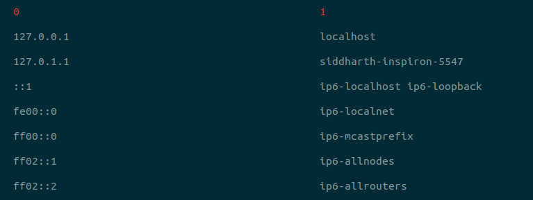

# get-hosts

> `etc/hosts` as an array of arrays, on the CLI.

[](https://travis-ci.org/icyflame/get-hosts-cli)

[](https://github.com/Flet/semistandard)

`get-hosts --pretty`




## CLI

```
$ npm install --global get-hosts-cli
```
```
$ get-hosts --help

  `etc/hosts` as an array of arrays, on the CLI.

  Usage
    $ get-hosts [--pretty]

  Examples
    $ get-hosts
    [ [ '127.0.0.1', 'localhost' ],
    [ '::1', 'ip6-localhost ip6-loopback' ],
    [ 'fe00::0', 'ip6-localnet' ],
    [ 'ff00::0', 'ip6-mcastprefix' ],
    [ 'ff02::1', 'ip6-allnodes' ],
    [ 'ff02::2', 'ip6-allrouters' ] ]

  Options
    -p, --pretty  Show as a table. Default: false

```


## Related

- [hemanth/get-hosts](https://github.com/hemanth/get-hosts) - API for this module


## License

MIT © [Siddharth Kannan](http://icyflame.github.io)
